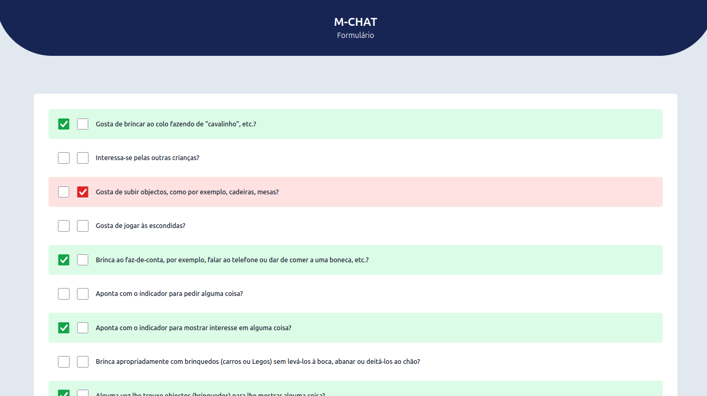

Este é o desenvolvimento Web do formulário para o projeto M-CHAT, segue um breve resumo:

Identificação de casos suspeitos de autismo em crianças de 16-30 meses nas escolas de
educação infantil com o objetivo de realizar as intervenções de forma precocemente , evitando que a
criança perca a melhor fase de estimulação e desenvolvimento. O projeto vai ser direcionado através
do M-CHAT informatizado como ferramenta de rastreio para se fazer um trabalho que priorize a
estimulação precoce nos primeiros meses de vida.

